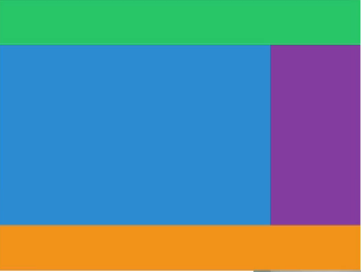
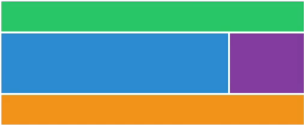

# CSS Layout

-  Positioning the element in CSS

1. Flexbox
2. Grid

-  We are going to learn by cloning websites.

# Table of Contents

-  [Table of Contents](#table-of-contents)
   -  [Flexbox](#1.1-Flexbox)

# Requirement

1. VSC or text editors
2. Brave Browser or Chrome Browser.
3. Node.JS

# 1.1 Flexbox

-  [x] flex-direction
-  [x] order
-  [x] justify-content
-  [x] align-items
-  [x] align-self
-  [x] flex-wrap
-  [x] align-content
-  [x] flex-grow
-  [x] flex-shrnk
-  [x] flex-basis

-  "display: block": is a long rectangular block that prohibits other elements from coming in.
-  "display: inline": You put all the elements in the same line next to each other. However, by default, there will be spaces between them.
-  Before, we used to put boxes inline and move each box by giving margins. (ex. nth-child(3){margin-left: 20px})
-  This became an old method because people started accessing the web using different devices (screensizes vary).
-

## 1.1a Rule 1

-  If you want to move anything, you need to create a **flexbox-container**.
-  In order to make the flex-box, you use below:

```
display: flex;
```

-  If you make the parent element into a flex-container, the children will be changed to flexboxes.
-  Flexboxes are not seperated by spaces as inline.

## 1.1b Main Axis and Cross Axis

-  **justify-content** modifies the position of flex children on the horiontal axis.
-  Options:

   -  center
   -  space-between
   -  space-around

-  row - main axis - horizontal - Use justify-content
-  column - y axis - vertical - Use align-items
   -  flex-start
   -  flext-end
-  Once the position is set, you can adjust the height as below:

```
height: 100vh;
```

# 1.1c Column and Row

-  flex-direction: > could be changed to either column (y-axis - cross axis) or row(x-axis - main axis).
   -  justify-content - main axis.
   -  align-items - cross axis.
      change main axis area - height
-  _Make sure to put in the height always because without height, it is not going to move_

# 1.1d align-self and order

-  we have been changing the flex-father to modify how flex-children behave.
-  align-self works exactly as align-item but also work on children as well.
-  if there are three boxes with numbers on them, we can modify the order of the boxes without changing the HTML. ( Boxes have order of 0 by default; order: 1; )
-  For example, if the order of the box was 1, 2, 3. If you set as below:

```
.child: nth-child(1) {
   order: 2;
}
.child: nth-child(2) {
   order: 3;
}
```

-  The order will be now 3, 1, 2 because box 3 has the order of 0 by default. The box 1 will have an order of 2; The box 2 will have an order of 3. Since boxes are organized by an order, it will appear as 3,1,2.

# 1.1e wrap, nowrap, reverse, align-content

Wrap:

-  flexbox tries to keep everything in one line even if it means modifying the preset width. By default, CSS is set as **flex-wrap**: wrap
-  However, if you want the flexbox to respect the preset width, use **flex-wrap**: nowrap.

Reverse:

-  **flex-direction** can be reversed as well like _column-reverse_ or _row-reverse_
-  **flex-wrap**: wrap-reverse > the line of boxes will break starting from the end of the line.

Align-content:

-  **align-content**: this is similar as justify-content but it is only for line; ex. space-around.

# 1.1f flex-grow, flex-shrink

-  **flex-shrink**: <#>: 1 - shrink 1 times; 2 - shrink 2 times; 3 - 3 times... etc.
-  Among 1, 2, 3 boxes, you want box 2 to shrink twice as faster when the window is minimized.
-  **flex-grow**: <#>: 1 - If there are available spaces, it will take the space.; 2
   -  Suppoes there are three boxes, you make flex-grow: 2 for 2 boxes. Then, the boxes with flex-grow will eat up the space around the boxes.

# 1.1g flex-basis

-  **flex-basis**:30%; gives an inital size of the flex-box.
-  flex-direction: column -> main axis become vertical.
   _Tip: Set the basis but they might grow_

# 1.1h flexbox froggy

Notes:

-  Justify-content: Move along in main axis (default: horizontal)

   -  flex-start: Items align to the left side of the container.
   -  flex-end: Items align to the right side of the container.
   -  center: Items align at the center of the container.
   -  space-between: Items display with equal spacing between them.
   -  space-around: Items display with equal spacing around them.

-  Align-items: Move along in the y axis(default: vertical)

   -  flex-start: Items align to the top of the container.
   -  flex-end: Items align to the bottom of the container.
   -  center: Items align at the vertical center of the container.
   -  baseline: Items display at the baseline of the container.
   -  stretch: Items are stretched to fit the container.

-  flex-direction: This CSS property defines the direction items.

   -  row: Items are placed the same as the text direction.
   -  row-reverse: Items are placed opposite to the text direction.
   -  column: Items are placed top to bottom.
   -  column-reverse: Items are placed bottom to top.

-  order: range could be negatives to positives.
-  align-self: this is same as align-items but for an individual box.

   -  align-self: stretch;
   -  align-self: center;
   -  align-self: start;
   -  align-self: end;

-  flex-wrap

   -  nowrap: Every item is fit to a single line.
   -  wrap: Items wrap around to additional lines.
   -  wrap-reverse: Items wrap around to additional lines in reverse.

-  flex-flow: was created to combine them. This shorthand property accepts the value of the two properties separated by a space.

   -  flex-flow: row wrap
   -  flex-flow: column wrap

-  align-content
   -  flex-start: Lines are packed at the top of the container.
   -  flex-end: Lines are packed at the bottom of the container.
   -  center: Lines are packed at the vertical center of the container.
   -  space-between: Lines display with equal spacing between them.
   -  space-around: Lines display with equal spacing around them.
   -  stretch: Lines are stretched to fit the container.

# 1.2 Grid

-  Why do you need grid and what does it solve?
-  Flex-box became problemic as we added more boxes. It seems like once justify-content: space-between is used on many boxes, it will basically cause anamoly of a huge spcae.
-  To solve this, people started making grids instead.

## 1.2a CSS Grid Basic Concepts

ex1:

```css
.father {
   display: grid;
   /* Create four grids of 20px, 55px, 90px, 100px */
   /* grid-template-columns: 20px 55px 90px 100px; */
   grid-template-columns: 250px 250px 250px;
   grid-template-rows: 100px 50px 300px;
   column-gap: 10px;
   row-gap: 10px;
   /* To conclude, you are telling the css to create a grid that has the sizes of specified sizes of rows and columns; set the column and row-gap in between them. */
}

.child {
   background: peru;
   color: white;
   font-size: 50px;
   display: flex;
   justify-content: center;
   align-items: center;
}
```

## 1.2b Grid Template Areas

```css
   .grid {
   grid-template-columns: auto 200px;
   grid-template-rows: 100px repeat(2, 200px) 100px;
   grid-template-areas:
      "header header header header"
      "content content content nav"
      "content content content nav"
      "footer footer footer footer";
   }
   .header {
   background-color: #2ecc71;
   grid-area: header;
   }
   .content {
   background-color: #3498db;
   grid-area: content;
   }
   .nav {
   background-color: #8e44ad;
   grid-area: nav;
   }
   .footer {
   background-color: #f39c12;
   grid-area: footer;
```

Output:


## 1.2c Rows and Columns

-  You can use rows and columns to set the box sizes set.
-  Suppose there are four boxes > set grid-column-start: 1 > set grid-column-end: 5
   -  This will fill up all the spot from 1 to 5.
-  Basically setting the grid-row-start / end or grid-column-start / end will stretch boxes to match the form that you want.

styles.css:

```javascript
.grid {
  display: grid;
  gap: 10px;
  grid-template-columns: repeat(4, 100px);
  grid-template-rows: repeat(4, 100px);
}

.header {
  background-color: #2ecc71;
  /* stretch 5 space amount horizontally */
  grid-column-start: 1;
  grid-column-end: 5;
}
.content {
  background-color: #3498db;
  /* stretch 4 space amount horizontally */
  /* stretch 2 space amount vertically */
  grid-column-start: 1;
  grid-column-end: 4;
  grid-row-start: 2;
  grid-row-end: 4;
}
.nav {
  background-color: #8e44ad;
   /* stretch 2 space amount vertically */
  grid-row-start: 2;
  grid-row-end: 4;
}
.footer {
  background-color: #f39c12;
  /* stretch 5 space amount horizontally */
  grid-column-start: 1;
  grid-column-end: 5;
}
```

Output:


## 1.2d Shortcuts

-  there are ways to shortcut your code with "#" / "#"

```javascript
grid-column 1/5; // Start: 1; End: 5
```

-  However, there are better ways to accomplish this.

-  "-1" will be same as all the way to the end.
-  **span** replaces start to end. Basically it is specifying how many cells you want to have.
-  If you implement span instead, you will see the below code:

```javascript
.header {
  background-color: #2ecc71;
  grid-column: span 4;
}
.content {
  background-color: #3498db;
  grid-column: 1 / -2;
  grid-row: span 2;
}
.nav {
  background-color: #8e44ad;
  grid-row: span 2;
}
.footer {
  background-color: #f39c12;
  grid-column: span 4;
```

## 1.2e Line Naming

-  You can name the lines if you want as [first-line], [second-line]...etc.

```css
/*first-line = 100 px; second-line = 100px ...etc*/
grid-template-columns: [first-line] 100px [second-line] 100px [third-line] 100px [fourth-line] 100px [fifth-line];
grid-template-rows: repeat(4, 100px [sexy-line]);
```

-  There are many options now, naming, numbers, span, and area. You can choose what you prefer. This is overall very powerful thing.
-

## 1.2f Grid Template

-  fraction could take the equal part.
-  need to set the height (ex. height. 50vh)

```
template-columns: 1fr 1fr 1fr 1fr;

```

-  **grid-template**: shorcut; mother of all shortcuts.
-  the good thing is that no matter how you resize the screen, the template will resize.

ex:

```css
.grid {
   display: grid;
   gap: 5px;
   height: 50vh;
   grid-template:
      "header header header header" 1fr
      "content content content nav" 2fr
      "footer footer footer footer" 1fr / 1fr 1fr 1fr 1fr;
}

.header {
   background-color: #2ecc71;
   grid-area: header;
}
.content {
   background-color: #3498db;
   grid-area: content;
}
.nav {
   background-color: #8e44ad;
   grid-area: nav;
}
.footer {
   background-color: #f39c12;
   grid-area: footer;
}
```



## 1.2g Place Items

Move Horizontal

-  justify-items: stretch is a default. It will stretch children.
-  justify-items: start - will not stretch.

Move Vertical

-  align-items: stretch
-  align-items: end

Shortcuts:
place-items: stretch / center (Vertical / Horizontal)

```css
  display: grid;
  gap: 5px;
  height: 50vh;
  grid-template-columns: repeat(4, 1fr);
  grid-template-rows: repeat(4, 1fr);
  place-items: stretch center;
}

.header {
  background-color: #2ecc71;
}
.content {
  background-color: #3498db;
}
.nav {
  background-color: #8e44ad;
}
.footer {
  background-color: #f39c12;
}
```

## 1.2h Place Content

-  grid element is big; justify-content will move the boxes within the grid.
-  align-content will move
-  boxes will stretch only when it is fractionalized.
-  place content can set the vertical(align-content) and horizontal(justify content) all together wilte place-item is moving an individual box.

```css
.grid {
   background: grey;
   color: white;
   display: grid;
   gap: 5px;
   height: 250vh;
   grid-template-columns: repeat(4, 100px);
   grid-template-rows: repeat(4, 100px);
   place-content: end center;
}
```

## 1.2i Auto Columns and Rows

-  To make CSS change the columns and rows automatically, you use auto.
-  A comination of justify-content and align-items will change how you place flexboxes.
-  Suppose there are 20 boxes on the screen, sometimes, you get more data than the allowed data.
-  **grid-auto-rows** or **grid-auto-columns**: whenever there are more boxes than we allowed, you set the default sizes and values.
-  If you want to do this for column, you use **grid-auto-flow: column or rows**

```css
grid {
   color: white;
   display: grid;
   gap: 5px;
   grid-template-columns: repeat(4, 100px);
   grid-template-rows: repeat(4, 100px);
   grid-auto-flow: column;
   grid-auto-columns: 100px;
}
```

## 1.2j minimax

-  min/max allows you to specify the minimum and maximum size of an element.
-  If you do not want the boxes to shrink at certain pixel, you use minmax().
-

```css
/* Don't shrink after it reaches 100 px*/
grid-template-columns: repeat(5, minmax(100px, 1fr));
/* Minimum shrink to 100px; Extended to 150px*/
grid-template-columns: repeat(4, minmax(100px, 150px));
```

## 1.2k auto-fit and auto-fill

-  if you use **auto-fill**, suppose there are 5 boxes, you will have many spaces. It fills the row with the many boxes as possible.
-  if you use **auto-fit**, it will stretch current elements to fit the current window size.
-  They look same on the small screen but when it gets big it is different. This is used in the responsive design. This is the basis of the responsive design.

## 1.2l mini-content and max-content.

-  **mini-content**: little content as possible.
-  **max-content**: goes all the way to fill out the element.
-  If you combine mini-max-content with other things we learned, we have a good design.

```
auto-fill, minmax( 20px, max-content)
auto-fit, minmax( 20px, max-content)
```

# 1.2 SCSS

-  SCSS(sexy CSS) is the preprocessor just as SASS.
-  stylus, less, are another example.
-  They have their distinct syntax usually is simpler than CSS.
-  SCSS became an industry standard. It made CSS into something like a programming langauge.
-  It will be much faster to do front-end tasks.
-  It requires compiation with an app like gulp.
-  Go to

## 1.2a Gulp

-  There is another course on Gulp.
-  git clone https://github.com/nomadcoders/scss-masterclass.git for now.
-  Type 'npm install' to install all dependencies.
-  Type 'npm run dev' to execute the server.

## 1.2b Variables and Nesting

-  by default, gulpfile.babel.js is watching src/scss. Whenever there is an update, it will be compiled to dist/style.css.
-  HTML is pointing to style.css for use.
-  **SCSS variables**:

   -  You can save most important colors and style in the variable for later use.
      src/\_variable.scss

   ```
   $bg: $e7473c;
   ```

   src/style.scss

   ```
   @import "_variables";

   body{
      background: $bg;
   }
   ```

-  Then, it can be compiled into css
-  **Nesting**: It allows you to be more precise in what element that you are targetting.
-  If you have two h1 in different places and you want to select only one, you can do .class h1 but you can do better with nesting.

```
.box {
   margin-top: 20px;
   h2 {
      // only h2 inside box will be affected.
      color: blue;
   }
}
```

-  you can also do certain element with action such as hover and others.

## 1.2c Mixins

-  Mixins allow us to reuse the code.
-  After you write the styles, you use the mixins. with @include
-  you can even do if else.
   @mixin <state the function name with even an argument>

@include <name of the function to use>

@if <condition>
mixins.scss:

```scss
@mixin link($color) {
   text-decoration: none;
   display: block;
   color: $color;
}
```

styles.scss:

```scss
@import "_variables";
@import "_mixins";

a {
   margin-bottom: 10px;
   &:nth-child(odd) {
      @include link(red);
   }
   button {
      color: red;
      &:nth-child(even) {
         @include link(blue);
      }
   }
}
```

index.html

```html
<!DOCTYPE html>
<html lang="en">
   <head>
      <meta charset="UTF-8" />
      <meta name="viewport" content="width=device-width, initial-scale=1.0" />
      <link rel="stylesheet" href="dist/css/reset.css" />
      <link rel="stylesheet" href="dist/css/styles.css" />
      <title>(S)CSS Masterclass</title>
   </head>
   <body>
      <a href="#">Google</a>
      <a href="#">Google</a>
      <a href="#">Google</a>
      <a href="#">Google</a>
   </body>
</html>
```

-  there is also @content keyword that is very useful.

-  if devices are different, you put different contents as below:
   mixins.scss

```scss
$minIphone: 500px;
$maxIphone: 690px;
$minTablet: $minIphone + 1;
$maxTablet: 1120px;

@mixin responsive($device) {
   @if $device == "iphone" {
      @media screen and (min-width: $minIphone) and (max-width: $maxIphone) {
         @content;
      }
   } @else if $device == "tablet" {
      @media screen and (min-width: $minTablet) and (max-width: $maxTablet) {
         @content;
      }
   } @else if $device == "iphone-l" {
      @media screen and (max-width: $minIphone) and (max-width: $maxIphone) and (orientation: landscape) {
         @content;
      }
   } @else if $device == "ipad-l" {
      @media screen and (min-width: $minTablet) and (max-width: $maxTablet) and (orientation: landscape) {
         @content;
      }
   }
}
```

-  There are already so many mixins such as Bourdon, Sass MediaQueries,
-  Animate.css - you can include effects.
-  Awesome-css in github shows all the libraries.

## 1.2d Extends

-  extends is for when you do not want to repeat the code. while mixins, when you want to differentiate the use of the code.
-  this concept is similar to inheriting traits. You can declare the base traits using @extends within the scss file.

-  Steps:

1. @import .scss that contains the base.
2. @extend

index.html

```html
  <body>

    <a href="#">Log In</a>
    <button>Log Out</button>
  </body>
</html>
```

\_buttons.scss

```scss
%button {
   font-family: inherit;
   border-radius: 7px;
   font-size: 12px;
   text-transform: uppercase;
   padding: 5px 10px;
   background-color: peru;
   color: white;
   font-weight: 500;
}
```

styles.scss

```scss
@import "_buttons";

a {
   @extend %button;
   text-decoration: none;
}

button {
   @extend %button;
   border: none;
}
```
